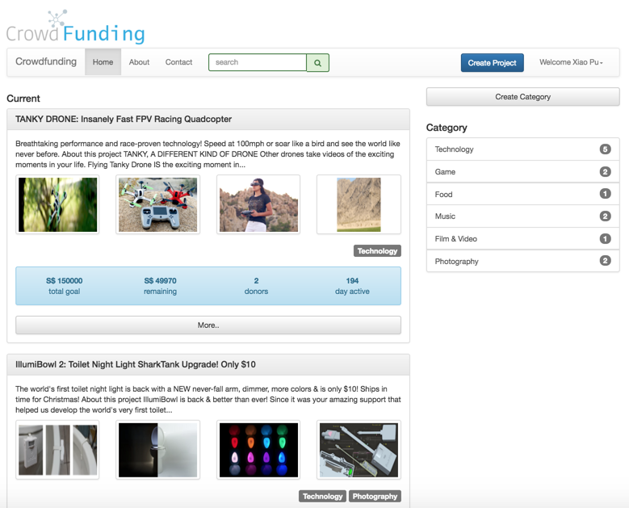
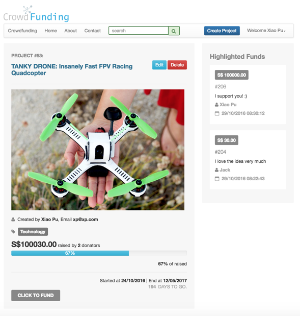
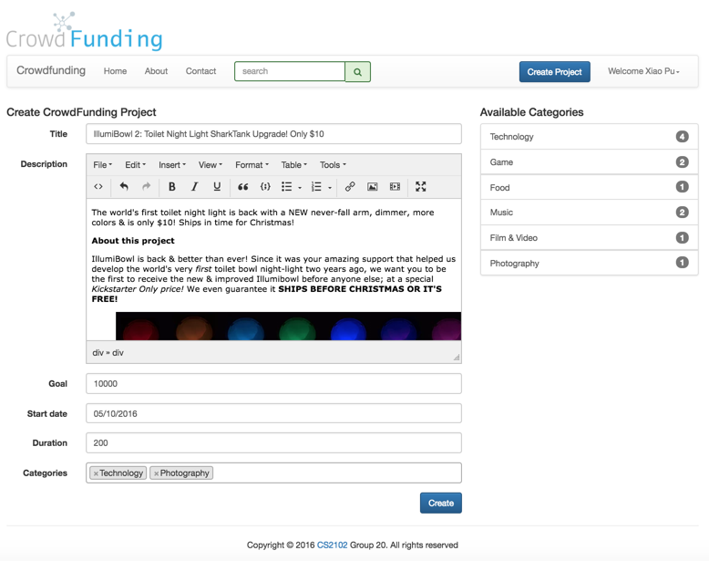

CROWDFUNDING
========

### Description
+ This is a school project in 2016 SEM1.
+ It is a CRUD web database application with the architecture of `Apache`, `PHP` and `PostgreSQL`.
+ It is written in `HTML`, `CSS`, `PHP`, and `PostgreSQL`.

### Screenshots
**Home Page:**

**Project Page:**

**Create a Project:**

